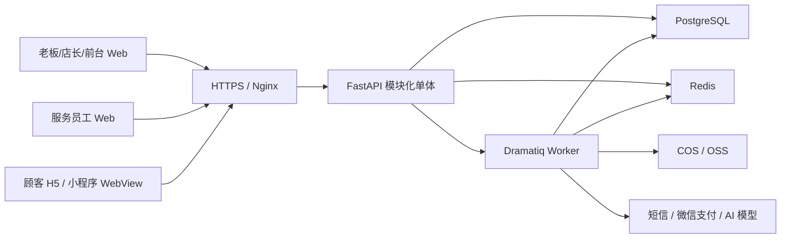

# 栖光美业 AI 平台后端实施方案

> 文档版本：v1.0
> 编制日期：2026-08-13
> 适用项目：`ai-meiye` 现有 React Web、顾客 H5 与微信小程序 WebView
> 推荐主技术栈：Python 3.13、FastAPI、PostgreSQL、SQLAlchemy 2、Alembic、Redis、Dramatiq

## 1. 项目目标

将当前纯前端、本机 `localStorage` 持久化的演示项目，升级为支持真实登录、多角色权限、多门店数据隔离、跨设备实时同步和完整交易审计的美业 SaaS 平台。

首个可用版本必须跑通以下核心链路：

```text
顾客手机登录并提交预约
→ 门店前台 Web 查看并确认预约
→ 服务员工 Web 更新到店、服务中、已完成状态
→ 系统生成待结算订单
→ 前台完成支付登记或次卡核销
→ 顾客查看订单、权益和消息
→ 必要时发起售后并完成审批处理
```

### 1.1 建设目标

- 用服务端认证替代浏览器本地角色登录。
- 用 PostgreSQL 替代 Zustand 业务数据持久化。
- 支持平台、商家、门店、员工、顾客五级数据边界。
- 在服务端执行预约冲突、优惠券、结算、次卡和售后规则。
- 实现手机端与 Web 端跨设备数据同步。
- 为支付、退款、AI 和原生小程序接入预留稳定接口。
- 保留当前前端页面和交互，采用渐进式迁移，避免整体重写。

### 1.2 第一版暂不包含

- 微服务拆分和 Kubernetes。
- 自研支付清算系统。
- 自训练 AI 模型。
- 原生微信小程序页面重写。
- 复杂财务会计、进销存和工资结算。
- 跨品牌统一会员体系。

## 2. 实施原则

1. **模块化单体优先**：所有业务模块部署为一个 FastAPI 应用，降低开发和运维复杂度。
2. **服务端是最终规则来源**：前端规则只用于即时反馈，不能决定权限、价格、库存、优惠和交易结果。
3. **以 ID 建立关联**：不再使用员工姓名、门店名称等文本作为业务关联依据。
4. **关键操作必须事务化**：预约、结算、次卡、退款和售后执行必须具备原子性。
5. **渐进迁移**：每完成一个后端模块，再替换对应 Zustand 数据，不一次性推翻当前前端。
6. **先闭环、后智能**：先完成可靠业务系统，再接入真实 AI。
7. **默认可审计**：交易、权限和状态变更都记录操作人、时间、来源和前后状态。

## 3. 推荐技术方案

| 领域 | 技术选择 | 说明 |
| --- | --- | --- |
| Python | Python 3.13 | 使用稳定的小版本并锁定依赖 |
| API 框架 | FastAPI | REST API、OpenAPI 文档、依赖注入 |
| 数据校验 | Pydantic 2 | 请求、响应和配置校验 |
| ORM | SQLAlchemy 2 | 使用异步会话与明确事务边界 |
| 数据迁移 | Alembic | 数据库版本化和可回滚迁移 |
| 数据库 | PostgreSQL 17 | 核心业务、事务、约束、报表 |
| 驱动 | asyncpg | PostgreSQL 异步驱动 |
| 缓存/限流 | Redis 7 | 验证码、会话辅助、限流和短期缓存 |
| 后台任务 | Dramatiq | 短信、提醒、通知、AI 调用、报表导出 |
| 身份认证 | JWT + HttpOnly Refresh Cookie | 后台 Web 会话；顾客端补短信/微信登录 |
| 密码安全 | Argon2id | 密码哈希，不保存明文密码 |
| API 客户端 | 前端 TanStack Query | 服务端状态、缓存和请求失效管理 |
| 测试 | pytest、pytest-asyncio、httpx | 单元、集成和 API 测试 |
| 代码质量 | Ruff、mypy、pre-commit | 格式、静态检查、提交前质量门禁 |
| 可观测性 | structlog、Sentry、OpenTelemetry | 日志、异常和链路追踪 |
| 部署 | Docker Compose 起步 | API、Worker、Redis；数据库优先使用云服务 |

## 4. 目标架构



### 4.1 仓库目标结构

第一阶段保留当前前端文件位置，后端直接增加在仓库根目录，避免一开始做大规模目录迁移：

```text
ai-meiye/
├── src/                         # 现有 React 前端
├── miniprogram/                 # 现有微信小程序 WebView 外壳
├── backend/
│   ├── app/
│   │   ├── api/                 # API 路由聚合
│   │   ├── core/                # 配置、安全、异常、数据库、日志
│   │   ├── common/              # 分页、审计、幂等、共享类型
│   │   ├── modules/
│   │   │   ├── auth/
│   │   │   ├── tenant/
│   │   │   ├── store/
│   │   │   ├── staff/
│   │   │   ├── service/
│   │   │   ├── schedule/
│   │   │   ├── customer/
│   │   │   ├── appointment/
│   │   │   ├── marketing/
│   │   │   ├── order/
│   │   │   ├── card/
│   │   │   ├── after_sale/
│   │   │   ├── notification/
│   │   │   ├── report/
│   │   │   ├── audit/
│   │   │   └── ai_advisor/
│   │   └── main.py
│   ├── migrations/
│   ├── scripts/
│   ├── tests/
│   ├── pyproject.toml
│   ├── alembic.ini
│   └── Dockerfile
├── docker-compose.yml
├── .env.example
└── pnpm-workspace.yaml
```

每个业务模块使用一致结构：

```text
appointment/
├── models.py
├── schemas.py
├── repository.py
├── service.py
├── router.py
├── permissions.py
└── tasks.py
```

## 5. 业务模块与现有前端映射

| 后端模块 | 当前代码/页面 | 后端主要职责 |
| --- | --- | --- |
| `auth` | `App.tsx` 登录与 `useSession` | 登录、刷新、退出、当前身份、密码管理 |
| `tenant` | 平台商家与套餐管理 | 商户开通、冻结、续期、套餐限制 |
| `store` | 门店管理、门店切换 | 门店资料、营业状态、营业时间 |
| `staff` | 员工管理、服务员工账号 | 员工档案、角色、门店范围、服务能力 |
| `schedule` | 员工排班 | 班次、休息、请假、批量排班 |
| `service` | 服务与次卡中的服务管理 | 服务资料、价格、门店范围、预约开关 |
| `customer` | 会员管理、我的顾客 | 会员档案、标签、统计和隐私数据 |
| `appointment` | 预约日历、顾客预约 | 可预约时段、预约事务、状态机 |
| `marketing` | 营销活动、优惠券 | 活动、领券、锁券、核销、释放 |
| `order` | 订单管理、开单收银 | 开单、订单快照、结算、支付登记 |
| `redemption` | 员工次卡核销 | 本人待核销服务、原子扣次、核销流水 |
| `card` | 次卡管理、顾客权益 | 卡产品、购卡、账本、核销、恢复 |
| `after_sale` | 顾客售后、门店售后 | 申请、受理、方案、审批和执行 |
| `notification` | 顾客消息、后台通知 | 站内信、未读数、异步提醒 |
| `report` | 经营报表、个人业绩 | 营收、客单、项目和员工业绩聚合 |
| `audit` | 平台日志 | 关键操作审计、导出和查询 |
| `ai_advisor` | AI 护理顾问 | 模型调用、结构化推荐、降级规则 |

## 6. 数据库实施方案

### 6.1 通用字段规范

商家业务表统一包含：

```text
id              UUID / UUIDv7
tenant_id       UUID
created_at      timestamptz
updated_at      timestamptz
created_by      UUID nullable
updated_by      UUID nullable
version         integer
```

门店业务表增加 `store_id`。金额字段统一使用 `numeric(12, 2)`；时间统一保存为 UTC，API 根据商户时区返回。

### 6.2 第一阶段核心表

#### 组织、用户与权限

```text
plans
tenants
stores
users
roles
permissions
user_roles
user_store_scopes
refresh_tokens
```

角色编码：

```text
platform_admin
owner
manager
receptionist
employee
customer
```

#### 员工、服务与排班

```text
staff_profiles
services
service_store_relations
staff_service_relations
staff_schedules
```

#### 会员与营销

```text
customers
tags
customer_tag_relations
marketing_activities
coupons
customer_coupons
```

#### 预约

```text
appointments
appointment_status_logs
```

#### 员工次卡核销

```text
orders
customer_cards
card_redemptions
```

员工核销必须以服务端身份限定为本人订单。订单和次卡使用行锁，同一订单通过唯一核销
流水保证幂等；会员、服务项目、有效期和剩余次数全部由 Python 服务端校验。

预约核心字段：

```text
tenant_id
store_id
customer_id
service_id
staff_id
start_at
end_at
status
original_price
discount_amount
payable_amount
customer_coupon_id
activity_id
note
source
version
```

### 6.3 第二阶段交易表

```text
orders
order_items
payments
refunds
card_products
customer_cards
card_transactions
after_sales
after_sale_logs
after_sale_attachments
notifications
audit_logs
idempotency_keys
```

### 6.4 关键数据库约束

- `orders.appointment_id` 唯一，防止完成服务时重复生成订单。
- `payments.provider_transaction_id` 唯一，防止支付回调重复入账。
- `idempotency_keys(scope, key)` 唯一，保护预约、结算、退款等写操作。
- `customer_coupons` 使用明确状态：`available/locked/used/expired`。
- 同一员工的有效预约使用 PostgreSQL `tstzrange` 排斥约束防止时间重叠。
- 顾客冲突由事务内查询和锁控制；必要时增加同类排斥约束。
- 业务表外键默认禁止级联删除；业务记录优先软删除或状态停用。

## 7. API 实施方案

所有接口统一使用 `/api/v1`，错误返回统一格式：

```json
{
  "code": "APPOINTMENT_TIME_CONFLICT",
  "message": "所选员工或顾客在相邻时段已有预约。",
  "requestId": "req_xxx",
  "details": {}
}
```

列表接口统一支持分页、排序和范围过滤；写接口返回最新实体和版本号。

### 7.1 认证与身份

```http
POST /api/v1/auth/login
POST /api/v1/auth/refresh
POST /api/v1/auth/logout
GET  /api/v1/auth/me
POST /api/v1/auth/change-password
```

### 7.2 门店、员工、服务、排班

```http
GET    /api/v1/stores
POST   /api/v1/stores
GET    /api/v1/stores/{id}
PATCH  /api/v1/stores/{id}
POST   /api/v1/stores/{id}/pause
POST   /api/v1/stores/{id}/resume

GET    /api/v1/staff
POST   /api/v1/staff
GET    /api/v1/staff/{id}
PATCH  /api/v1/staff/{id}
PUT    /api/v1/staff/{id}/services
POST   /api/v1/staff/{id}/disable
POST   /api/v1/staff/{id}/enable

GET    /api/v1/services
POST   /api/v1/services
PATCH  /api/v1/services/{id}
POST   /api/v1/services/{id}/publish
POST   /api/v1/services/{id}/unpublish

GET    /api/v1/schedules
PUT    /api/v1/schedules/batch
DELETE /api/v1/schedules/{id}
```

### 7.3 会员、预约与消息

```http
GET    /api/v1/customers
POST   /api/v1/customers
GET    /api/v1/customers/{id}
PATCH  /api/v1/customers/{id}

GET  /api/v1/appointments
GET  /api/v1/appointments/{id}
GET  /api/v1/appointments/available-slots
POST /api/v1/appointments
POST /api/v1/appointments/{id}/confirm
POST /api/v1/appointments/{id}/arrive
POST /api/v1/appointments/{id}/start
POST /api/v1/appointments/{id}/complete
POST /api/v1/appointments/{id}/cancel
POST /api/v1/appointments/{id}/no-show

GET  /api/v1/notifications
POST /api/v1/notifications/{id}/read
POST /api/v1/notifications/read-all
```

### 7.4 订单、次卡与售后

```http
GET  /api/v1/orders
GET  /api/v1/orders/{id}
POST /api/v1/orders
POST /api/v1/orders/from-appointment
POST /api/v1/orders/{id}/settle

GET  /api/v1/card-products
POST /api/v1/card-products
PATCH /api/v1/card-products/{id}
POST /api/v1/customer-cards
GET  /api/v1/customer-cards
GET  /api/v1/customer-cards/{id}/transactions

GET  /api/v1/after-sales
POST /api/v1/after-sales
POST /api/v1/after-sales/{id}/receive
POST /api/v1/after-sales/{id}/proposal
POST /api/v1/after-sales/{id}/approve
POST /api/v1/after-sales/{id}/reject
POST /api/v1/after-sales/{id}/complete
```

### 7.5 报表、平台和 AI

```http
GET  /api/v1/reports/overview
GET  /api/v1/reports/revenue
GET  /api/v1/reports/staff-performance
GET  /api/v1/reports/service-performance
POST /api/v1/reports/export

GET  /api/v1/platform/tenants
POST /api/v1/platform/tenants
PATCH /api/v1/platform/tenants/{id}
POST /api/v1/platform/tenants/{id}/freeze
POST /api/v1/platform/tenants/{id}/renew

POST /api/v1/ai/advisor/recommend
POST /api/v1/ai/business/summary
```

## 8. 权限与数据范围

权限判断分为两层：

1. **RBAC 权限**：角色是否能执行某个动作。
2. **数据范围**：用户能够访问哪个商户、门店、员工或顾客的数据。

| 角色 | 默认数据范围 | 关键能力 |
| --- | --- | --- |
| 平台管理员 | 全平台租户元数据 | 套餐、商户状态、平台审计 |
| 老板 | 当前商户全部门店 | 全部经营数据和配置 |
| 店长 | 所属门店 | 预约、会员、员工、排班、报表、审批 |
| 前台 | 所属门店 | 预约接待、开单收银、售后受理 |
| 服务员工 | 本人及授权顾客 | 本人日程、服务状态、个人业绩 |
| 顾客 | 本人 | 本人预约、订单、权益、售后、消息 |

实施要求：

- `tenant_id`、角色和门店范围从服务端登录身份获得。
- 前端提交的 `tenant_id` 不参与授权判断。
- 平台管理员查看会员敏感信息时默认脱敏并记录审计。
- 服务员工不可自行将预约从“已确认”直接改为“已完成”。
- 所有越权访问统一返回 403，不透露目标数据是否存在。

## 9. 核心事务与状态机

### 9.1 创建预约

单个 PostgreSQL 事务内完成：

1. 校验当前身份与门店访问范围。
2. 校验门店营业状态和营业时间。
3. 校验服务在线、可预约并适用于该门店。
4. 校验员工在职、服务能力和当天排班。
5. 检查员工和顾客时间冲突，包含 10 分钟整理时间。
6. 如使用优惠券，以行锁方式校验并锁定。
7. 插入预约记录和初始状态日志。
8. 提交事务后发送异步通知。

### 9.2 预约状态机

```text
待确认 → 已确认 → 已到店 → 服务中 → 已完成
   └→ 已取消       └→ 未到店
```

不同角色只开放符合职责的动作接口。预约完成时，在同一事务中创建唯一待结算订单。

### 9.3 订单结算

1. 根据版本号锁定待结算订单。
2. 校验优惠金额和应收金额，禁止相信前端计算值。
3. 现金/线下支付写支付登记；微信支付等待签名回调。
4. 次卡支付锁定卡记录并写核销流水。
5. 核销优惠券。
6. 更新订单状态和会员消费统计。
7. 写审计日志并异步通知顾客。

### 9.4 售后处理

```text
待受理 → 处理中 → 待审批
                    ├→ 待退款 → 已完成
                    ├→ 待重做 → 已完成
                    ├→ 待补偿 → 已完成
                    └→ 已驳回
```

退款、恢复卡次、重做预约分别实现为独立领域操作。不得只修改售后状态而不执行实际账务动作。

## 10. 前端迁移方案

### 10.1 状态职责调整

迁移后：

- TanStack Query：门店、员工、会员、预约、订单、次卡、售后、报表等服务端数据。
- Zustand/组件状态：当前页、筛选条件、抽屉开关、表单草稿等纯 UI 状态。
- HttpOnly Cookie：刷新令牌。
- 内存或受控存储：短期访问令牌；不再把角色作为可信权限来源保存。

### 10.2 渐进替换顺序

| 批次 | 前端范围 | 替换目标 |
| --- | --- | --- |
| 1 | 登录、当前用户、门店、员工、服务、排班 | 建立认证和主数据基础 |
| 2 | 会员、预约、优惠券、消息 | 打通手机预约与 Web 接待 |
| 3 | 订单、收银、次卡、售后 | 打通真实交易闭环 |
| 4 | 报表、平台租户、AI 顾问 | 完成经营与智能能力 |

### 10.3 兼容策略

- 增加 `VITE_API_BASE_URL` 配置。
- 每个模块迁移完成后再移除对应 Zustand 持久化数据。
- 开发阶段允许 `VITE_DATA_MODE=demo|api` 切换，生产环境只允许 `api`。
- API 错误码映射为当前中文业务提示。
- 迁移期间保留现有前端纯函数规则，用于表单即时反馈。
- 服务端返回结果覆盖前端计算结果。

### 10.4 必须同步修复的现有问题

- 到店订单必须保存 `staff_id`，不能只保存员工姓名。
- 删除固定 `DEMO_TODAY` 对生产业务的依赖。
- 顾客身份不能仅由 `?shop=qiguang` 决定。
- 全局搜索需要接入后端分类型搜索接口，或者在第一版明确移除入口。
- “AI 顾问”在接入模型前标注为智能推荐，保留关键词规则作为降级策略。

## 11. 分阶段实施计划

以下工期以 **2 名后端、1 名前端、1 名兼职测试/产品** 为基准，预计 10～12 周。单人全栈实施建议预留 16～24 周。

### 阶段 0：项目准备与设计冻结（第 1 周）

任务：

- 确认第一版范围、角色权限矩阵和核心验收链路。
- 建立 `backend/` 项目骨架和本地 Docker 环境。
- 配置 FastAPI、SQLAlchemy、Alembic、Redis、日志和测试框架。
- 建立 CI：Ruff、mypy、pytest、前端 typecheck/test/build。
- 完成数据库 ERD、API 命名和错误码规范评审。
- 明确手机号、备注、AI 对话等敏感数据处理规范。

交付物：

- 可启动的 API、Worker、PostgreSQL、Redis 开发环境。
- `/health/live` 和 `/health/ready` 健康检查。
- 首版数据库迁移和 OpenAPI 页面。
- CI 质量门禁。

验收：

- 新成员按 README 可在 30 分钟内启动全部开发服务。
- 数据库迁移可以在空库正向执行并安全回滚。

### 阶段 1：认证、多租户和主数据（第 2～3 周）

任务：

- 实现商户、门店、用户、角色、门店授权范围。
- 实现登录、刷新、退出、当前用户和密码哈希。
- 实现门店、员工、服务和排班 CRUD。
- 创建现有六种演示账号和初始数据种子。
- 前端登录和上述主数据改为 API。
- 服务员工 Web 使用真实身份和本人数据范围。

交付物：

- 六角色真实登录。
- 老板全门店、店长/前台所属门店、员工本人范围隔离。
- 门店、员工、服务和排班可跨浏览器共享。

验收：

- 修改 URL、角色参数或请求体不能越权。
- 停用员工后不能登录，也不能被分配新预约。
- 暂停营业门店不能产生新预约。

### 阶段 2：会员、预约、优惠券和通知（第 4～6 周）

任务：

- 实现会员资料、标签和门店访问范围。
- 将现有预约规则迁移到服务端并补数据库冲突约束。
- 实现可预约时段、顾客预约和后台代客预约。
- 实现预约状态机和状态流水。
- 实现优惠券领取、锁定、释放、核销。
- 实现站内通知和未读数。
- 使用 SSE 推送预约与通知变化；若暂不做 SSE，则使用短轮询降级。
- 前端预约、会员、顾客端消息改用 API。

交付物：

- 手机顾客端提交预约，后台 Web 可在数秒内看到。
- 前台确认后，顾客端收到消息并看到状态变化。
- 员工 Web 只看到本人日程并可执行被授权的状态动作。

验收：

- 并发请求不能把同一员工预约到重叠时段。
- 相邻预约保留 10 分钟整理时间。
- 预约取消能正确释放优惠券。
- 重复提交相同幂等键只产生一条预约。

### 阶段 3：订单、收银、次卡和售后（第 7～9 周）

任务：

- 实现订单、订单明细和服务快照。
- 预约完成后幂等创建待结算订单。
- 实现到店开单，强制关联 `staff_id`。
- 实现现金、微信、支付宝登记和次卡结算。
- 实现卡产品、顾客持卡和不可变交易流水。
- 实现售后申请、受理、方案、审批和执行。
- 实现退款记录、卡次恢复和操作审计。
- 前端订单、权益、售后页面改用 API。

交付物：

- 从预约完成到收银的完整交易链路。
- 次卡购买、核销和售后恢复均可追溯。
- 顾客端能够查看真实订单、卡项和售后状态。

验收：

- 重复结算、重复支付回调和重复退款不会重复记账。
- 订单金额由服务端计算，篡改前端金额无效。
- 每次卡次变化都存在对应流水。
- 退款金额不能超过原订单可退金额。

### 阶段 4：报表、平台能力和 AI（第 10～11 周）

任务：

- 实现经营概览、营收趋势、项目表现和员工业绩。
- 实现平台租户、套餐、冻结、续期和日志。
- 实现 CSV 异步导出。
- 接入真实 AI 模型，使用 Pydantic 结构化输出。
- AI 推荐结果再次校验服务、门店、价格、优惠和可预约状态。
- 保留当前关键词规则作为超时、限流或模型故障时的降级方案。
- 记录模型、提示词版本、耗时、Token 使用和安全结果。

交付物：

- 报表数据来自服务端真实订单和预约。
- AI 顾问能返回有效服务 ID，并可继续进入正常预约流程。

验收：

- 各角色的报表范围与权限一致。
- AI 不得推荐不存在、下线或不适用当前门店的服务。
- AI 故障不影响预约和交易主链路。

### 阶段 5：上线准备与灰度（第 12 周）

任务：

- 完成全链路回归、性能、安全和恢复演练。
- 准备测试、预发布和生产环境。
- 配置 HTTPS、域名、备份、Sentry 和监控告警。
- 完成初始商户数据导入脚本。
- 小范围门店灰度，收集日志和使用反馈。
- 完成上线、降级和回滚手册。

交付物：

- 生产部署包和版本说明。
- 数据备份与恢复验证记录。
- 灰度门店验收报告。

验收：

- 核心业务 E2E 全部通过。
- 可在约定恢复时间内完成数据库恢复。
- API 或 AI 故障时有明确降级提示，不产生错误交易。

## 12. 工作分解清单

### 后端基础

- [ ] 初始化 FastAPI 项目与配置管理。
- [ ] 配置数据库连接池和事务会话。
- [ ] 配置 Alembic 迁移。
- [ ] 配置 Redis 和 Dramatiq。
- [ ] 建立统一响应、异常和错误码。
- [ ] 建立请求 ID、结构化日志和审计上下文。
- [ ] 建立分页、排序和查询规范。
- [ ] 建立幂等中间件/服务。
- [ ] 建立健康检查和优雅退出。

### 身份与权限

- [ ] 用户、角色、权限和门店范围模型。
- [ ] 登录、刷新、退出和令牌吊销。
- [ ] Argon2id 密码策略。
- [ ] RBAC 权限依赖。
- [ ] Tenant/Store 数据范围过滤。
- [ ] 登录失败限流和安全审计。

### 核心业务

- [ ] 门店、员工、服务、排班。
- [ ] 会员和标签。
- [ ] 可预约时段计算。
- [ ] 预约事务和冲突约束。
- [ ] 预约状态日志和通知。
- [ ] 活动和优惠券状态机。
- [ ] 订单、明细和支付记录。
- [ ] 次卡产品、持卡和流水。
- [ ] 售后状态机及执行动作。
- [ ] 报表查询与导出。
- [ ] 平台租户和套餐。
- [ ] AI 结构化推荐与降级。

### 前端迁移

- [ ] 增加统一 API Client 和错误处理。
- [ ] 引入 TanStack Query。
- [ ] 登录与会话刷新。
- [ ] 主数据查询和写入。
- [ ] 预约和通知实时同步。
- [ ] 订单、次卡、售后迁移。
- [ ] 报表与平台功能迁移。
- [ ] 删除对应业务数据的 localStorage 持久化。
- [ ] 保留演示种子和本地开发模式。

## 13. 测试方案

### 13.1 后端单元测试

重点覆盖：

- 预约状态机。
- 售后状态机。
- 优惠券适用范围与金额。
- 次卡核销和恢复。
- 角色权限和数据范围。
- 金额计算和退款上限。
- AI 推荐结果校验。

### 13.2 数据库集成测试

使用独立 PostgreSQL 测试库，覆盖：

- 事务提交和回滚。
- 预约并发冲突。
- 幂等键唯一性。
- 支付回调重复处理。
- 次卡流水与余额一致性。
- 多租户查询隔离。

### 13.3 API 测试

- 登录、刷新和退出。
- 六角色正常访问与越权访问。
- 所有核心动作接口的成功和失败分支。
- 请求校验、分页、错误码和并发版本控制。

### 13.4 前端与端到端测试

建议引入 Playwright，至少覆盖：

1. 顾客预约 → 前台确认 → 员工服务 → 前台结算。
2. 顾客使用优惠券预约 → 取消 → 优惠券恢复。
3. 次卡结算 → 售后恢复卡次。
4. 店长/前台/员工之间的操作权限差异。
5. 老板切换全部门店与单门店范围。
6. 平台冻结商户后，商户账号访问受限。

### 13.5 质量门禁

每个合并请求必须通过：

```text
backend: ruff + mypy + pytest
frontend: typecheck + unit tests + build
database: migrations check
security: dependency audit
```

## 14. 部署与运维

### 14.1 环境划分

```text
development
staging
production
```

三套环境使用不同数据库、Redis、对象存储目录、支付配置和模型密钥。

### 14.2 初期部署拓扑

- 前端：COS/OSS + CDN，或现有静态托管平台。
- API：2 个 FastAPI 实例，置于 HTTPS 网关后。
- Worker：至少 1 个 Dramatiq Worker，可独立扩容。
- PostgreSQL：云数据库，开启自动备份和高可用选项。
- Redis：云 Redis 或独立容器，生产环境启用持久化与访问控制。
- 文件：COS/OSS，不写入 API 容器本地磁盘。

### 14.3 数据库发布规范

- 使用 expand/contract 方式发布破坏性结构变更。
- 先增加兼容字段，再发布代码，最后清理旧字段。
- 禁止在高峰期执行长时间锁表迁移。
- 每次生产迁移前完成备份并验证回滚方案。

### 14.4 监控指标

- API 请求量、P95/P99 延迟和错误率。
- PostgreSQL 连接数、慢查询、锁等待。
- Redis 连接、内存和任务积压。
- 预约冲突率、结算失败率、支付回调失败率。
- 消息发送失败率。
- AI 响应时间、错误率、Token 成本和降级比例。

## 15. 安全与合规

- 密码使用 Argon2id，不记录明文密码和令牌。
- 手机号、联系方式和健康/护理备注属于敏感数据。
- 日志中对手机号、令牌、支付信息和 AI 输入做脱敏。
- 上传文件限制类型、大小，并使用随机对象键。
- 后台接口配置 CORS 白名单、CSRF 防护和速率限制。
- 支付回调验证签名、时间戳并实现幂等。
- 数据导出记录操作者、范围、时间和导出原因。
- 顾客数据删除/匿名化需要设计保留期，不直接破坏财务审计记录。
- AI 输出明确声明不替代医疗诊断，输入模型前去除不必要的身份信息。

## 16. 初始数据迁移

当前 `src/data.ts` 是演示数据，不应直接作为生产数据导入。实施时分两类处理：

1. **演示/测试环境**：编写幂等 seed 脚本，生成当前品牌、门店、员工、会员、服务、预约、订单和平台账号。
2. **生产环境**：使用经过确认的 CSV/Excel 导入模板，只导入商户真实主数据，不导入虚构交易。

导入顺序：

```text
套餐 → 商户 → 门店 → 用户/员工 → 服务 → 员工服务关系
→ 排班 → 会员 → 优惠券/活动 → 期初次卡 → 未完成预约
```

每批导入都输出成功、失败、重复和校验错误报告。

## 17. 风险与应对

| 风险 | 影响 | 应对措施 |
| --- | --- | --- |
| 一次性替换全部 Zustand | 回归范围过大 | 按模块渐进迁移，保留开发切换开关 |
| 预约并发重复 | 服务冲突、客诉 | 事务、行锁、数据库排斥约束 |
| 多租户数据泄漏 | 严重安全事故 | 服务端统一作用域、越权集成测试、审计 |
| 支付/退款重复回调 | 重复记账 | 幂等键、唯一约束、事务 |
| 次卡余额不一致 | 财务与客诉风险 | 不可变流水、定期一致性校验 |
| AI 生成虚假项目/价格 | 误导顾客 | 结构化输出、服务端二次校验、规则降级 |
| 报表实时查询变慢 | 页面超时 | 索引、汇总表、异步导出，按实际量级演进 |
| 固定演示日期残留 | 数据和报表失真 | 统一业务时钟和时区服务 |

## 18. 里程碑验收标准

### M1：基础后端可用

- 六角色可以真实登录。
- 门店、员工、服务、排班通过 API 管理。
- 不同商户和门店数据不可越权访问。

### M2：预约跨设备闭环

- 手机创建预约，Web 可实时或准实时看到。
- 前台、员工和顾客看到同一条状态链。
- 并发和优惠券规则经过服务端与数据库保护。

### M3：交易闭环

- 服务完成后只生成一张待结算订单。
- 现金类和次卡均可正确结算。
- 售后退款与恢复卡次可追溯、可审计。

### M4：经营与 AI

- 报表数据与交易数据一致。
- 平台租户和套餐功能可用。
- AI 只能推荐真实可售服务，模型不可用时可降级。

### M5：生产上线

- 核心 E2E、权限、安全和恢复演练通过。
- 具备日志、监控、告警、备份和回滚能力。
- 至少一家灰度门店完成真实流程验收。

## 19. 项目完成定义（Definition of Done）

一个后端功能只有同时满足以下条件才算完成：

- API、数据库迁移和权限策略均已实现。
- 输入校验、业务错误码和审计日志完整。
- 单元测试和数据库集成测试覆盖关键成功/失败路径。
- OpenAPI 文档可用，前端已完成真实接口联调。
- 不依赖前端传入的租户、角色、金额或最终状态。
- 幂等、并发和事务边界经过验证。
- 日志无敏感信息泄漏。
- 预发布环境完成产品和测试验收。

## 20. 建议立即启动的第一批任务

1. 创建 `backend/` FastAPI 骨架和 Docker Compose。
2. 确定 PostgreSQL 数据模型、角色权限矩阵和错误码规范。
3. 完成商户、门店、用户、员工、服务、排班的首批迁移。
4. 接通现有登录页和服务员工 Web 的真实身份。
5. 将现有 `business-rules.ts` 的预约用例同步为 Python 测试基线。
6. 实现预约 API 和数据库并发约束。
7. 跑通“顾客预约 → 前台确认 → 员工服务 → 创建待结算订单”第一条纵向链路。

完成这条纵向链路后，再并行扩展订单、次卡、售后、报表和 AI，可以显著降低整体返工风险。
